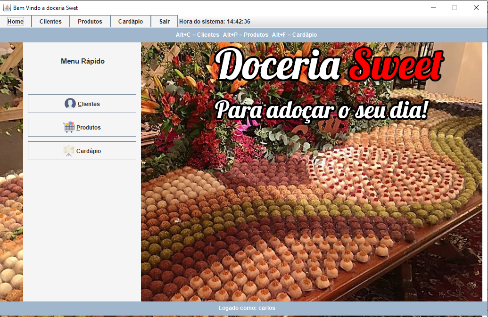

# Doceria Sweet

Java Desktop program, complete CRUD with login levels.



## Installation


```bash
Start netbeans or similar
```
```bash
Upload the database (src / meubanco.sql)
```
```bash
Change connection credentials (src / BD.java)
```


## Usage

```bash
Administrador - login:adm senha:adm
```


## License
- You can use the code for study.
- You may not use it for commercial purposes, subject to penalties under local law.
